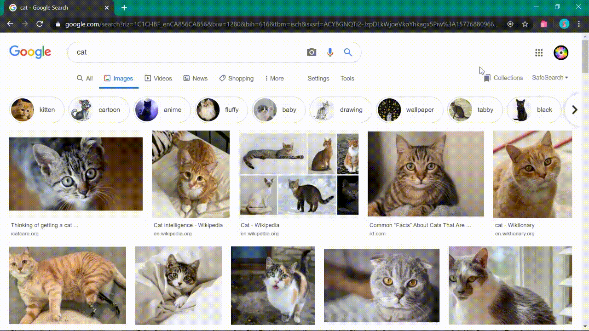

#Flashcards

Flashcards is a chrome extension that quizzes you every time you open a new web page.

###Customization Options Available:
* Change number of web pages you can browse before being quizzed.
* Add pages to be whitelisted to avoid being interrupted on them.
* Add new flashcards through the small popup menu, and delete them on the options page.

Adding new flashcards:

Example of browsing two pages before getting quizzed:

###Installing
1. Download this Git repository.
2. In Google Chrome, navigate to the extensions menu and turn on Developer Mode.
3. Click on "Load unpacked" and select the downloaded Git repository to install.
